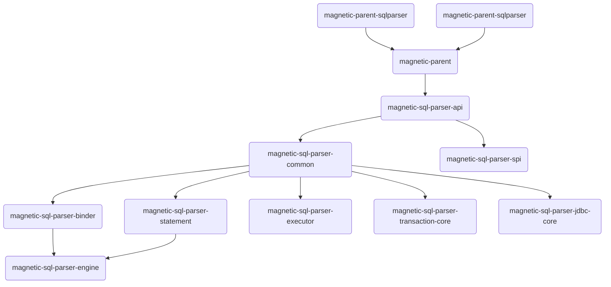

## [M-SQLParser - 解析SQL语句并将其转换为Java类的层次结构](https://gitee.com/M-SQLParse/M-SqlParser)

[](https://gitee.com/M-SQLParse/M-SqlParser/stargazers)
[](https://gitee.com/M-SQLParse/M-SqlParser/members)
[](https://www.apache.org/licenses/LICENSE-2.0.html)
[](https://travis-ci.org/iByteCoding/M-SQLParser)
[](https://codecov.io/gh/iByteCoding/M-SQLParser)
[](https://bestpractices.coreinfrastructure.org/projects/5394)
[](http://opentracing.io)
[](https://github.com/apache/skywalking)

| **星评增长时间线**                                                                                                       | **贡献者增长时间线**                                                                                                                                                                                                                                |
|:---------------------------------------------------------------------------------------------------------------------:|:------------------------------------------------------------------------------------------------------------------------------------------------------------------------------------------------------------------------------------------------:|
| [](https://starchart.cc/iByteCoding/M-SQLParser) | [](https://git-contributor.com?chart=contributorOverTime&repo=iByteCoding/M-SQLParser) |

### 概述

<hr>

`M-SqlParser`解析SQL语句并将其转换为Java类的层次结构。生成的层次结构可以使用Visitor Pattern进行导航

`连接`、`增强` 和 `可插拔` 是 M-SqlParser 的核心概念。

- `连接：`通过对数据库协议、SQL 方言以及数据库存储的灵活适配，快速的连接应用与多模式的异构数据库；
- `增强：`待完善；
- `可插拔：`项目采用微内核 + 三层可插拔模型，使内核、功能组件以及生态对接完全能够灵活的方式进行插拔式扩展，开发者能够像使用积木一样定制属于自己的独特系统。


### 社区和支持💝🖤

<hr>

**Github**

:link: [GitHub Issues](https://github.com/iByteCoding/M-SQLParser/issues). Github社区 | 适合于设计问题、缺陷报告或者开发相关；

**Gitee**

:link: [Gitee Issues](https://gitee.com/M-SQLParse/M-SqlParser/issues). Gitee社区 | 适合于设计问题、缺陷报告或者开发相关；

### 模块说明
```
|_ magnetic-parent                 #SQL解析引擎父模块-统一进行依赖模块版本管理以及外部依赖包管理
    |_ magnetic-parent-sqlparser   #SQL解析引sqlparser核心包声明
    |_ magnetic-parent-third       #第三方库，负责引入公共开源lib库版本定义、maven发布配置、环境配置等职责
    
---------------------------------
|_ magnetic-sql-parse 
    |_ magnetic-sql-parser-api         #SQL解析引擎注解、接口、工具类以及相关VO的定义
    |_ magnetic-sql-parser-common      #SQL解析引擎基础模块
    |_ magnetic-sql-parser-spi         #SQL解析引擎SPI拓展业务组
    |_ magnetic-sql-parser-binder      #SQL解析引擎元数据定义以及属性类型定义
    |_ magnetic-sql-parser-statement   #SQL解析引擎解析dal、ddl、tcl以及聚合函数、逻辑运算符、语法构建、语法提取等声明

---------------------------------

|_ magnetic-sql-parser-engine      #SQL解析引擎执行引擎

```

### 模块依赖图


### 本地编译指南
1.magnetic-parent 构建安装至私服或者本地仓库
```shell
mvn install -s ~/.m2/settings-magnetic.xml -f pom.xml
```
注意：使用本地默认或者独立的setting.xml 进行构建

2.依次将magnetic-sql-parser-*系列模块添加只maven管理
```shell
add as maven project
```


###  :pencil:  更新笔记
[核心功能更新笔记](https://gitee.com/M-SQLParse/M-SqlParser/blob/develop/Update-notes.md)
