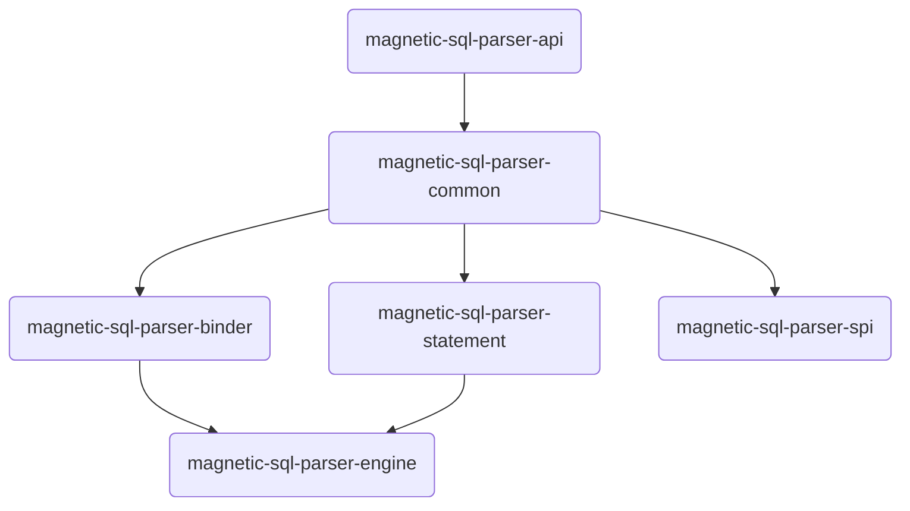

#  M-SQLParser

M-SqlParser解析SQL语句并将其转换为Java类的层次结构。生成的层次结构可以使用Visitor Pattern进行导航

### 模块说明
```
- magnetic-parent                 #SQL解析引擎父模块-统一进行依赖模块版本管理以及外部依赖包管理
    - magnetic-parent-sqlparser   #SQL解析引sqlparser核心包声明
    - magnetic-parent-third       #第三方库，负责引入公共开源lib库版本定义、maven发布配置、环境配置等职责

- magnetic-sql-parser-api         #SQL解析引擎注解、接口、工具类以及相关VO的定义
- magnetic-sql-parser-common      #SQL解析引擎基础模块
- magnetic-sql-parser-spi         #SQL解析引擎SPI拓展业务组
- magnetic-sql-parser-binder      #SQL解析引擎元数据定义以及属性类型定义
- magnetic-sql-parser-statement   #SQL解析引擎解析dal、ddl、tcl以及聚合函数、逻辑运算符、语法构建、语法提取等声明

- magnetic-sql-parser-engine      #SQL解析引擎执行引擎
```

### 模块依赖图


###  :pencil:  更新笔记
[核心功能更新笔记](https://gitee.com/M-SQLParse/M-SqlParser/blob/develop/Update-notes.md)
